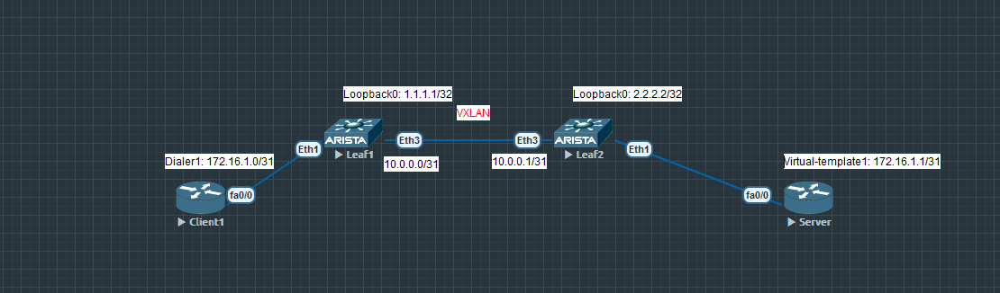
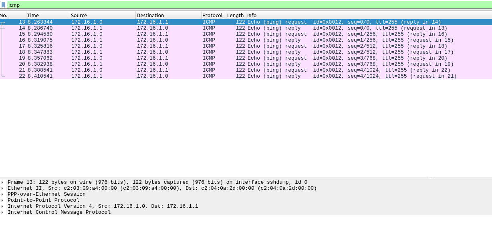

# pppoe поверх vxlan

### Топология


### Конфигурация 
Листинг конфигурации pppoe клиента и сервера находятся в конфигах  

Настройка leaf1 для статического туннеля vxlan
```
interface Ethernet1
   switchport access vlan 10
!
interface Ethernet3
   no switchport
   ip address 10.0.0.0/31
   ip ospf network point-to-point
!
interface Loopback0
   ip address 1.1.1.1/32
!
ip routing
!
router ospf 1
   network 1.1.1.1/32 area 0.0.0.0
   network 10.0.0.0/32 area 0.0.0.0
! 
 interface Vxlan1
   vxlan source-interface Loopback0
   vxlan udp-port 4789
   vxlan vlan 10 vni 10010
   vxlan vlan 10 flood vtep 2.2.2.2
 ```

Настройка leaf2 для статического туннеля vxlan
```
interface Ethernet1
   switchport access vlan 10
!
interface Ethernet3
   no switchport
   ip address 10.0.0.1/31
   ip ospf network point-to-point
!
interface Loopback0
   ip address 2.2.2.2/32
!
ip routing
!
router ospf 1
   network 2.2.2.2/32 area 0.0.0.0
   network 10.0.0.1/32 area 0.0.0.0
!
interface Vxlan1
   vxlan source-interface Loopback0
   vxlan udp-port 4789
   vxlan vlan 10 vni 10010
   vxlan vlan 10 flood vtep 1.1.1.1
```

### Проверка
На leaf1 проверяем ospf и доступность лупбеков для vxlan туннеля
```
Leaf1#sh ip route ospf

VRF: default
Codes: C - connected, S - static, K - kernel,
       O - OSPF, IA - OSPF inter area, E1 - OSPF external type 1,
       E2 - OSPF external type 2, N1 - OSPF NSSA external type 1,
       N2 - OSPF NSSA external type2, B - Other BGP Routes,
       B I - iBGP, B E - eBGP, R - RIP, I L1 - IS-IS level 1,
       I L2 - IS-IS level 2, O3 - OSPFv3, A B - BGP Aggregate,
       A O - OSPF Summary, NG - Nexthop Group Static Route,
       V - VXLAN Control Service, M - Martian,
       DH - DHCP client installed default route,
       DP - Dynamic Policy Route, L - VRF Leaked,
       G  - gRIBI, RC - Route Cache Route

 O        2.2.2.2/32 [110/20] via 10.0.0.1, Ethernet3

Leaf1#ping 2.2.2.2 source 1.1.1.1
PING 2.2.2.2 (2.2.2.2) from 1.1.1.1 : 72(100) bytes of data.
80 bytes from 2.2.2.2: icmp_seq=1 ttl=64 time=17.3 ms
80 bytes from 2.2.2.2: icmp_seq=2 ttl=64 time=11.4 ms
80 bytes from 2.2.2.2: icmp_seq=3 ttl=64 time=5.79 ms
80 bytes from 2.2.2.2: icmp_seq=4 ttl=64 time=4.67 ms
80 bytes from 2.2.2.2: icmp_seq=5 ttl=64 time=4.21 ms

--- 2.2.2.2 ping statistics ---
5 packets transmitted, 5 received, 0% packet loss, time 57ms
rtt min/avg/max/mdev = 4.218/8.691/17.352/5.039 ms, pipe 2, ipg/ewma 14.422/12.720 ms

Leaf1#sh vxlan vtep
Remote VTEPS for Vxlan1:

VTEP          Tunnel Type(s)
------------- --------------
2.2.2.2       unicast, flood

Total number of remote VTEPS:  1

```
Смотрим дамп с помощью wireshark с Client1 проверяя что pppoe трафик вылетел в сеть с интерфейса fa0/0. По заголовкам видим что идет Ethernet, pppoe, icmp

